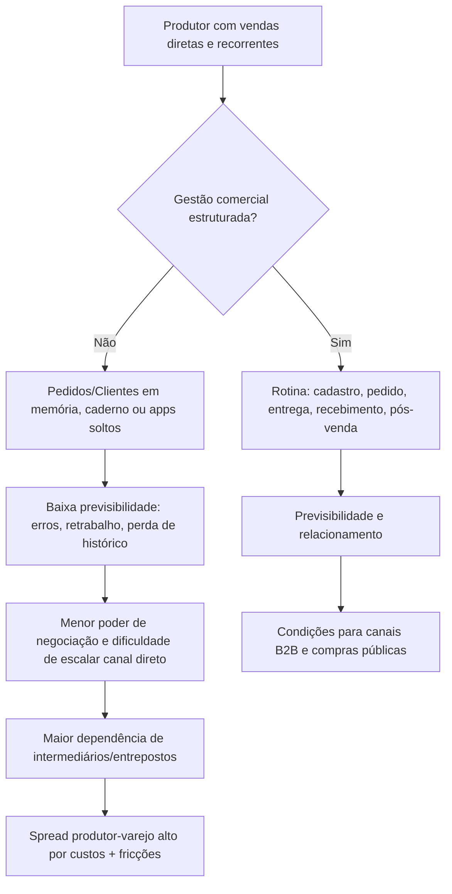
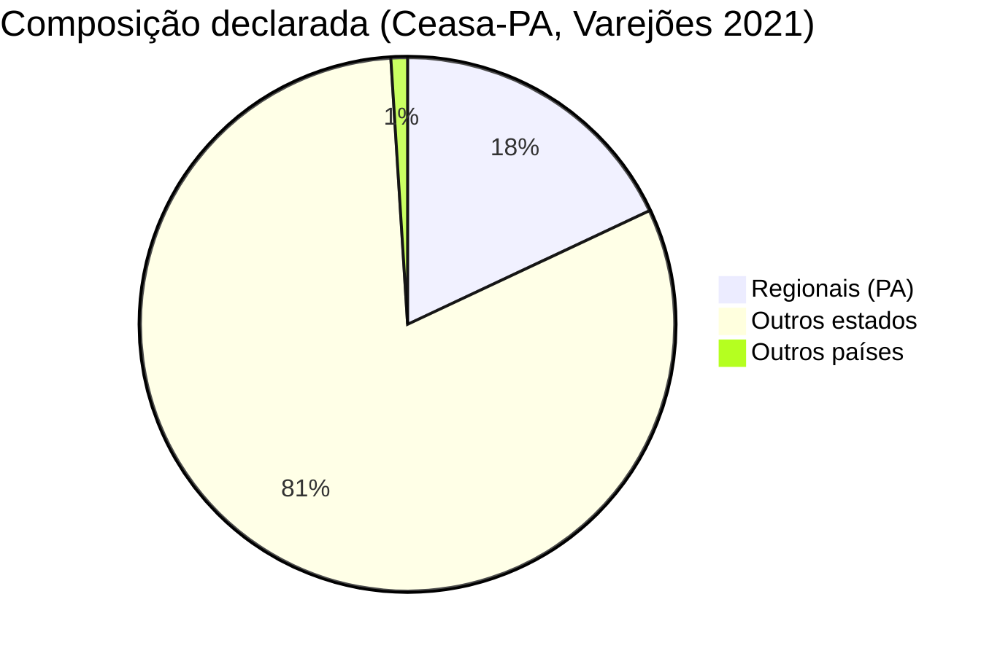
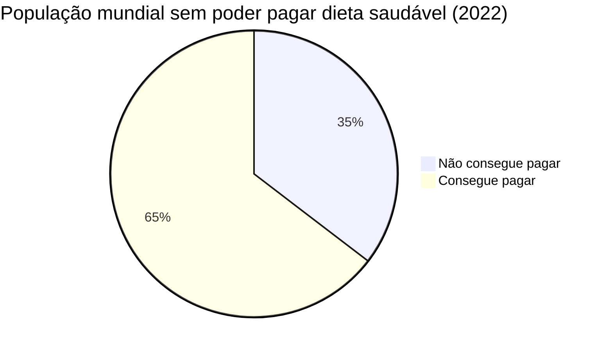
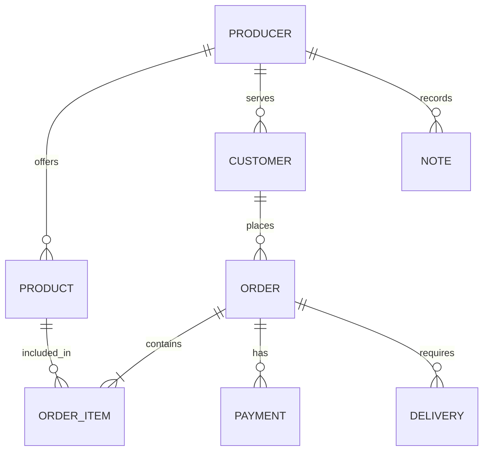
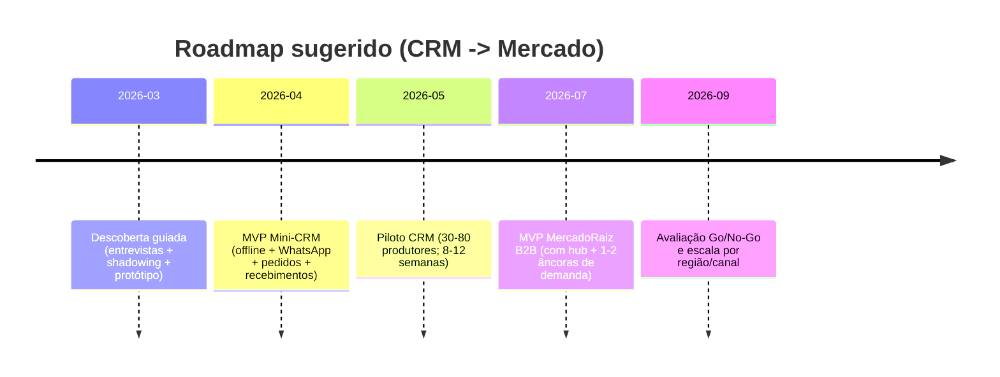

# Validação do problema para Mini-CRM Rural e MercadoRaiz no

## Resumo executivo

Com base no material fornecido (matriz de hipóteses/evidências e enunciados do problema) fileciteturn0file0 fileciteturn0file1 e em pesquisa complementar na web, a formulação do problema é **moderadamente a fortemente suportada**, com diferentes níveis de robustez conforme o “pedaço” do problema e conforme o produto analisado.

Há evidência **forte** de que (i) a agricultura familiar é numericamente dominante em estabelecimentos e emprego rural, mas não em área, e possui papel relevante no abastecimento interno (indicando que há um público potencialmente grande para soluções de gestão e comercialização) citeturn3search0; (ii) produtores rurais usam significativamente ferramentas digitais “genéricas” (como redes sociais e mensageria) para obter/divulgar informações e para comprar/vender, mas relatam barreiras relevantes de custo, conectividade e conhecimento para adoção mais sofisticada citeturn17view0turn12view0; (iii) a gestão técnico‑econômica em pequenas unidades pode ser **informal** e pouco registrada, com uso limitado de cadernos/planilhas e dependência de memória/anotações, o que enfraquece tomada de decisão e organização comercial — evidência diretamente alinhada ao “wedge” de um Mini‑CRM citeturn43view0.

Para o MercadoRaiz (marketplace/distribuição), a evidência é **mais heterogênea**: há sinais consistentes de cadeias longas e dependência logística/intermediários em determinados contextos (por exemplo, elevada participação de produtos “de fora” em varejões/entrepostos e relatos de aumento de custo de frete por gargalos de infraestrutura) citeturn50view0turn29view0. Ao mesmo tempo, há evidência forte de que **parte do spread produtor‑varejo decorre de custos e serviços reais** (classificação, perdas, embalagens, transporte, impostos, risco), e que “intermediação” não é sinônimo automático de “extração de margem injustificada” — implicando que um marketplace que apenas “remove o intermediário” tende a falhar se não resolver operação/logística/serviço citeturn7view0turn6view0.

Um achado estratégico particularmente relevante para 2026 é que o Programa Nacional de Alimentação Escolar teve o percentual mínimo de compra direta da agricultura familiar ampliado para **45% a partir de 1º de janeiro de 2026**, por lei federal — o que torna compras públicas (e exigências de regularidade/entrega) uma alavanca concreta de demanda previsível, potencialmente integrável ao desenho de produto (CRM e/ou marketplace B2B) citeturn34view0turn30search14.  

Avaliação geral: **Mini‑CRM Rural** aparece como um caminho de menor risco (produto “single‑player”, menos dependente de rede e logística pesada) e com evidência direta; **MercadoRaiz** é plausível, mas exige validação operacional e desenho de “intermediação melhor” (coordenação, consolidação, logística, garantia de qualidade/pagamento), não apenas desintermediação. citeturn43view0turn7view0turn29view0turn34view0

## Escopo, suposições e lacunas de informação

O tema “original” não foi explicitado em texto livre, então este relatório assume como escopo principal a **validação do problema** e implicações para dois conceitos: **Mini‑CRM Rural** (SaaS vertical para gestão comercial/operacional de pequenos produtores com vendas diretas e recorrentes) e **MercadoRaiz** (marketplace/plataforma de distribuição digital conectando produtores locais a compradores). Essa suposição é derivada dos documentos carregados pelo usuário, que trazem o enunciado do problema, a matriz de evidências e o formato de saída esperado. fileciteturn1file2L6-L45 fileciteturn1file1L1-L7

Suposições operacionais usadas (por falta de detalhes):
- O foco são **alimentos frescos** (hortifrúti e perecíveis) e vendas em escala local/regional (não commodities). fileciteturn1file2L6-L23  
- Há ênfase nas regiões **Norte** e **Centro‑Oeste** do Brasil, conforme a matriz, mas com inferências nacionais quando a literatura é nacional. fileciteturn1file1L1-L4  
- O público‑alvo inclui produtores com baixo a médio nível de formalização e com uso de ferramentas “fragmentadas” (mensagens, anotações, memória). fileciteturn1file2L11-L18

Principais lacunas que limitam conclusões “de decisão”:
- Segmentação exata: perfil do produtor (tamanho, mix de produtos, canais atuais, formalização fiscal/sanitária, cooperado vs individual).  
- Lado da demanda do MercadoRaiz: quem compra (restaurantes, mercados, escolas/PNAE, consumidores finais), frequência, ticket, requisitos e SLAs.  
- Capacidade de execução logística (própria, parceiros, cooperativas, hubs) e apetite de risco/capital.  
- Critérios de sucesso (métricas‑alvo) e restrições de orçamento/time.  

Essas lacunas não impedem a validação qualitativa do problema, mas afetam a escolha do “modelo certo” para o MercadoRaiz. citeturn7view0turn43view0turn34view0

## Metodologia de pesquisa e validação

A abordagem seguiu três trilhas, alinhadas ao roteiro nos arquivos do usuário: (i) extração de evidências e referências da matriz; (ii) verificação de existência/aderência das referências; (iii) pesquisa adicional em fontes prioritárias (institucionais e acadêmicas) para confirmar ou tensionar a formulação do problema. fileciteturn1file0L9-L85

Critério de força da evidência (adotado do material do usuário):
- **STRONG**: fontes oficiais/primárias e pesquisa revisada por pares (ex.: entity["organization","IBGE","brazil statistics institute"], entity["organization","FAO","un food agency"], entity["organization","Embrapa","brazil agricultural research"], artigos acadêmicos). fileciteturn1file0L31-L35  
- **MODERATE**: relatórios setoriais, associações e mídia reputada.  
- **WEAK**: posts opinativos, relatos anedóticos sem método.  
- **INVALID**: referência não verificável ou que não sustenta a afirmação.

Para validação de citações, quando possível foi checado se: a página existe; o texto contém o número/afirmação (ou equivalente); e se há coerência temporal (ano/edição). Exemplo: no caso do custo/afordabilidade de dietas saudáveis, a matriz menciona “11% em 2022”; o material de base do relatório SOFI 2024 confirma aumento de 11% no ano subsequente às altas de 2020/2021, enquanto a notícia‑resumo da FAO explicita aumentos de 2020 e 2021 — exigindo cuidado na redação (validando o “sinal”, mas ajustando o detalhe temporal conforme a fonte). citeturn37view1turn36view0

## Síntese de evidências

### Evidências extraídas da matriz e avaliadas

A tabela abaixo consolida evidências “núcleo” da matriz, com checagem de fonte e utilidade para o problema (operacional, econômico, cadeia de valor, dados para crédito/seguro, adoção digital). fileciteturn1file1L3-L7

| Evidência (resumo) | Fonte validada | Ano | Força | Dimensão do problema |
|---|---:|---:|---|---|
| Agricultura familiar: 77% dos estabelecimentos; 23% da área; 23% do valor da produção; 67% do pessoal ocupado no campo (dados do Censo Agro 2017). | IBGE (divulgação do Censo Agro). citeturn3search0 | 2019 | STRONG | Mercado endereçável; relevância socioeconômica |
| Em entreposto no Pará, no varejão analisado: 18% produtos regionais, 81% de outros estados e 1% de outros países (números declarados). | Agência Pará / Ceasa‑PA. citeturn50view0 | 2022 | MODERATE | Cadeia longa; dependência logística; oportunidade para coordenação local |
| Relato de produtores no Amazonas: “cartel de atravessadores”; após mudar canal, produtor relata +60% lucro e redução de desperdício de ~50% para 15% (caso anedótico). | CIEAM (republicação de notícia local). citeturn18view0 | 2018 | WEAK | Risco de poder de barganha; efeito potencial de redução de intermediação (não generalizável) |
| Diferença produtor‑varejo aumenta com cadeia mais longa e perecibilidade; porém o spread é composto por custos/serviços (perdas, logística, classificação etc.). | Cepea/HF Brasil. citeturn7view0turn6view0 | 2017 | STRONG | Cadeia de valor; evita diagnóstico simplista (“intermediário = vilão”) |
| Adoção digital: 84% dos agricultores usam ao menos uma tecnologia digital; uso forte de redes/mensagens; 40% usam para compra/venda; custo e conectividade são barreiras relevantes (pesquisa com >750 participantes; 504 agricultores). | Embrapa (parceria com Sebrae e Inpe). citeturn17view0 | 2020 | STRONG | Ferramentas fragmentadas; viabilidade de produto leve e integrado a WhatsApp/offline |
| Evidência de baixa formalização de controles: apenas 16,9% registram dados técnicos/econômicos em cadernos/planilhas; em muitos casos, informações ficam na memória/anotações; 37,3% não controla entradas/saídas de dinheiro. | Revista Brasileira de Gestão e Desenvolvimento Regional (artigo com survey). citeturn43view0 | 2015 | STRONG | Núcleo do Mini‑CRM (gestão informal e baixa rastreabilidade operacional/comercial) |
| Dietas saudáveis: 35,4% da população mundial (2,83 bilhões) não pôde pagar dieta saudável em 2022; custo da dieta saudável aumentou no período analisado (base SOFI 2024). | FAO (SOFI 2024; dataset de custo/afordabilidade). citeturn36view0turn37view1 | 2024 (dados 2022) | STRONG | Justificativa social/econômica: preço/accesso a alimentos frescos |
| Gargalos logísticos regionais podem elevar custo de frete e dificultar contratação de transporte (relato jornalístico no norte de MT). | Canal Rural (MT). citeturn29view0 | 2023 | MODERATE | Cadeia de valor; necessidade de desenho logístico (MercadoRaiz) |
| Compras públicas: percentual mínimo do PNAE para compra direta da agricultura familiar foi elevado de 30% para 45% a partir de 01/01/2026; programa com orçamento anual citado e regras de validade/entrega. | MEC/FNDE (com base em lei federal). citeturn34view0turn30search14 | 2025–2026 | STRONG | Demanda previsível B2B; requisitos operacionais; potencial “âncora” para marketplace/CRM |

### Classificação por produto

A seguir, a mesma evidência agrupada por relevância para (i) Mini‑CRM Rural, (ii) MercadoRaiz, (iii) ambos. fileciteturn1file0L37-L57

**Relevantes para Mini‑CRM Rural**

| Evidência | Força | Por que é “direta” para Mini‑CRM |
|---|---|---|
| Gestão informal e baixa taxa de registro (16,9% em cadernos/planilhas; memória/anotações; lacunas em controle financeiro). citeturn43view0 | STRONG | Sustenta o problema operacional: dificuldade de organizar vendas recorrentes, clientes, pedidos e histórico |
| Uso difundido de mensageria/redes sociais para informações e compra/venda (57,5% para obter/divulgar info; ~40% para compra/venda), combinado a barreiras de custo/conectividade. citeturn17view0turn12view0 | STRONG | Sugere que o “canal” já existe, mas falta estrutura (CRM leve, offline, integrado a WhatsApp, com baixo atrito) |
| Debate de seguro rural aponta necessidade de dados granulares e atualizados e limitações de dados públicos para parametrizar produtos. citeturn44view0 | MODERATE | Reforça tese de que gerar dados operacionais padronizados pode destravar crédito/seguro no futuro (via parcerias) |

**Relevantes para MercadoRaiz**

| Evidência | Força | Por que é “direta” para MercadoRaiz |
|---|---|---|
| Alta participação de produtos de fora no entreposto analisado no Pará (18/81/1). citeturn50view0 | MODERATE | Indica cadeia longa e dependência logística; sugere demanda por coordenação regional e melhor conexão oferta‑demanda |
| Gargalos logísticos elevando custo de frete e dificultando transporte (norte de MT). citeturn29view0 | MODERATE | Mostra que “marketplace + logística” precisa considerar custo/risco de transporte como variável central |
| Compras públicas (PNAE 45%) como demanda previsível — mas com regras/criticidades de entrega e validade. citeturn34view0turn30search14 | STRONG | Cria oportunidade de canal B2B institucional e exige capacidade operacional (cadastro, entrega, regularidade) |

**Relevantes para ambos**

| Evidência | Força | Implicação comum |
|---|---|---|
| Spread produtor‑varejo aumenta com cadeia longa, mas inclui custos/serviços de intermediação. citeturn7view0turn6view0 | STRONG | Tanto CRM quanto marketplace devem reduzir fricção/custo e aumentar previsibilidade; “tirar intermediário” não basta |
| Relevância socioeconômica e escala potencial do segmento (Censo Agro 2017). citeturn3search0 | STRONG | Segmento grande o suficiente para justificar produto; exige segmentação e abordagem por nicho/canal |
| Pressão de preços e baixa acessibilidade de dietas saudáveis no agregado (SOFI 2024). citeturn36view0turn37view1 | STRONG | Justifica foco em eficiência de cadeias de alimentos frescos (impacto social + demanda) |

image_group{"layout":"carousel","aspect_ratio":"16:9","query":["Ceasa Belém Pará entreposto","feira agricultura familiar Brasil hortifruti","caminhão transporte hortifruti Brasil estrada","produtor rural agricultura familiar hortaliças Brasil"],"num_per_query":1}

### Visualizações para “ancorar” a intuição

A cadeia descrita pelo problema pode ser entendida como dois gargalos que se reforçam: (1) **gargalo micro (gestão/registro/comercial)** e (2) **gargalo meso (coordenação/logística/mercado)**. Abaixo, um fluxograma simplificado (interpretativo, não uma afirmação factual). citeturn43view0turn7view0turn29view0

**Pie charts** (para dar escala a dois indicadores citados em fontes):

- Composição declarada de produtos no caso do varejão (exemplo do Pará). citeturn50view0

- Participação mundial sem acesso econômico a dieta saudável em 2022 (aproximação percentual reportada). citeturn36view0turn37view1

### Modelo mínimo de dados para o Mini‑CRM

A evidência sugere que o núcleo do produto deve transformar “memória/anotações/WhatsApp” em **registro consultável** (clientes, pedidos, entregas, pagamentos), com fricção mínima e tolerante a conectividade. citeturn43view0turn17view0turn12view0

## Evidências que contradizem ou enfraquecem a hipótese

A matriz aponta “pouco acesso a tecnologias de gestão/automação/IA” para pequenos produtores; isso é **parcialmente verdadeiro**, mas há um contraponto importante: a pesquisa Embrapa/Sebrae/Inpe mostra adoção ampla de alguma tecnologia digital (84%) e uso intensivo de redes sociais/mensagens como “porta de entrada” — o que sugere que o problema não é “ausência total de digital”, e sim **ausência de estrutura e integração** (do WhatsApp para um sistema de gestão). citeturn17view0. Portanto, um Mini‑CRM que exigir mudança drástica de hábito (ex.: “abandone WhatsApp e use só o app”) tende a ter adoção limitada; a hipótese se fortalece quando o CRM é desenhado como **camada de organização sobre o que já é usado**. citeturn17view0turn43view0

Para o MercadoRaiz, a contraprova mais importante é econômica/operacional: Cepea/HF Brasil mostram que o spread produtor‑varejo pode refletir custos e serviços reais (classificação, perdas, armazenagem, embalagem, transporte, impostos e risco) e que parte da margem é funcional para a cadeia. citeturn7view0turn6view0. Isso enfraquece qualquer formulação do tipo “intermediário é apenas extração”; o marketplace precisa **substituir serviços** (ou integrá‑los) para reduzir custo total e melhorar preço líquido ao produtor, sob pena de deslocar o problema. citeturn7view0turn29view0

Além disso, algumas evidências usadas na matriz são **anedóticas** (por exemplo, um caso de aumento de lucro e queda de desperdício após mudar de feira/canal) e não sustentam generalização sem amostra, controle e replicabilidade — úteis para “hipótese” e storytelling, fracas para decisão de investimento. citeturn18view0turn43view0

## Implicações estratégicas e recomendações acionáveis

### Implicações para desenho do Mini‑CRM Rural

A evidência mais forte (gestão informal e baixa sistematização do controle) implica que o Mini‑CRM deve ser:
- **Assistente de rotina**, não “ERP”: cadastrar compradores, registrar pedidos recorrentes, gerar lembretes e histórico de preços/volumes; registrar entregas e recebimentos; controlar inadimplência; e “puxar” relatórios simples (vendas por cliente, por produto, por semana). A evidência de 16,9% usar caderno/planilha e uso de memória/anotações indica que “simplicidade e hábito” são mais críticos que riqueza de funcionalidades. citeturn43view0  
- **Integrado ao WhatsApp** (ou, no mínimo, compatível): a pesquisa aponta mensageria como meio de informação/compra/venda para grande parte; portanto, o CRM deve converter conversas em registros (ex.: botão “registrar pedido”, modelos de mensagem, catálogo rápido, link de confirmação). citeturn17view0  
- **Offline‑first / tolerante à internet ruim**: conectividade é citada como entrave relevante; sincronização assíncrona e UX resiliente reduzem churn por frustração. citeturn17view0turn12view0  
- **Orientado a “capacidade de prova”**: o debate sobre seguro rural menciona falta de dados granulares e atualizados; mesmo sem “resolver seguro”, o CRM pode produzir trilhas de evidência (volume, regularidade, sazonalidade de receita, histórico de entregas) para parcerias futuras com cooperativas, bancos, seguradoras e programas públicos. citeturn44view0turn43view0  

Recomendação prática de MVP (conjunto mínimo):
1) Cadastro simples de clientes (nome, contato, endereço, preferência).  
2) Pedido recorrente (itens, quantidade, preço, data, status).  
3) Entrega (rota simples e “confirmado/pendente”).  
4) Recebimento (pago/pendente, método).  
5) Relatório semanal (3 números: total vendido, pendências, top clientes).  

### Implicações para o modelo do MercadoRaiz

O MercadoRaiz, para ser viável, precisa ser concebido como uma **infraestrutura de coordenação** (marketplace + serviços), e não só como “app de matching”. Três implicações decorrem diretamente da evidência:

1) **O valor econômico está em reduzir custo total e incerteza**, não só em reduzir intermediários. Cepea/HF Brasil mostram que a margem existe por múltiplos componentes; logo, o MercadoRaiz deve atacar desperdício, consolidação de cargas, padronização mínima, previsibilidade e risco de pagamento/entrega. citeturn7view0turn6view0turn29view0

2) **Cadeias longas e dependência de abastecimento externo** (como o caso documentado no Pará) sugerem que a oportunidade pode estar em “substituição parcial” (onde houver oferta local) ou em “logística de origem” (consolidar pequenos volumes para melhorar custo unitário), e não em prometer autossuficiência local. citeturn50view0turn29view0

3) **Compras públicas como ‘demanda âncora’**: o aumento para 45% no PNAE cria demanda previsível e volumes relativamente estáveis, mas eleva exigência de conformidade/entrega (qualidade, variedade, prazos). Isso combina com um modelo B2B que ofereça (a) ordenação antecipada, (b) roteirização simples, (c) documentação e (d) agregação por cooperativas/associações/hubs. citeturn34view0turn30search14

Sugestão de modelo inicial menos arriscado para MercadoRaiz:
- Começar por **B2B de recorrência** (restaurantes, mercados, merenda escolar), com catálogo curto e ciclos semanais, e operar via **hubs** (associações/cooperativas/entrepostos parceiros) que façam consolidação e controle de qualidade. Isso reduz o “grau de rede” necessário e reduz o risco de last‑mile difuso. A própria evidência de gargalos de transporte e custo de frete sugere que a execução logística é o gargalo real. citeturn29view0turn7view0

### Recomendações acionáveis de validação (antes de “build grande”)

1) **Teste de campo do Mini‑CRM com métrica de hábito**: medir redução de “perdas de informação” (pedidos esquecidos, inconsistência de preço, ausência de histórico) e tempo gasto por semana; objetivo é provar valor imediato para quem hoje usa memória/caderno/WhatsApp. A evidência de informalidade torna este teste muito informativo. citeturn43view0turn17view0  

2) **Piloto MercadoRaiz com uma âncora de demanda** (ex.: entidade pública local ou rede de restaurantes) e um hub: o objetivo não é volume, e sim provar: fill rate, taxa de entrega no prazo, custo logístico por kg, e redução de variabilidade de preço para o comprador. O aumento do PNAE para 45% torna esse tipo de piloto mais relevante em 2026. citeturn34view0turn29view0  

3) **Evitar narrativa “anti‑intermediário” no posicionamento**: o discurso deve ser “cadeia mais eficiente e transparente”, pois a literatura setorial aponta que parte do spread é custo/serviço legítimo; a proposta de valor é reduzir fricções e desperdícios, não demonizar o atacado. citeturn7view0turn6view0  

## Roadmap, orçamento indicativo e entregáveis

Abaixo um roadmap “de risco decrescente” (primeiro CRM, depois mercado), com orçamento como **estimativa de ordem de grandeza** (OOM) — não é um dado factual, e sim uma proposta de planejamento para um time enxuto.

### Linha do tempo sugerida

### Orçamento OOM e entregáveis (exemplo)

| Fase | Duração | Entregáveis | Faixa OOM (R$) | Hipóteses que valida |
|---|---:|---|---:|---|
| Descoberta guiada | 4–6 semanas | Mapa de jornada; protótipo; métricas e baseline | 40k–120k | “Dor” real; disposição de uso; barreiras (conectividade, alfabetização digital) |
| MVP Mini‑CRM | 6–10 semanas | App/WEB leve; offline; cadastro/pedidos/recebimentos; relatórios | 150k–450k | Produto reduz caos operacional? valor semanal imediato? |
| Piloto CRM | 8–12 semanas | Onboarding; suporte; dashboards; melhorias | 120k–350k | Retenção; recorrência; impacto em tempo/erro; “não‑usuários” por quê |
| MVP MercadoRaiz B2B | 10–16 semanas | Catálogo; pedidos programados; hub; roteirização simples; pagamentos | 300k–900k | Unit economics inicial; SLA; custo logístico; churn comprador/produtor |

Métricas mínimas recomendadas:
- Mini‑CRM: ativação (primeiro pedido registrado), retenção 4 e 8 semanas, número de pedidos/semana, % pedidos com pagamento registrado, tempo economizado auto‑reportado (com auditoria por amostra).  
- MercadoRaiz: fill rate, OTIF (on‑time in‑full), custo logístico/kg, perdas (kg descartado), variação de preço para comprador, atraso de recebimento ao produtor.

## Validação das referências citadas na matriz

A tabela abaixo responde “existe?” e “é válida para a afirmação?” (no sentido de conter e sustentar o ponto usado). Onde houve barreira de acesso (paywall) ou discrepância de detalhe (ano/percentual), isso é explicitado.

| Referência (como na matriz) | Existe | Válida | Notas |
|---|---|---|---|
| Agência FAPESP (tecnologias no campo; democratização do acesso) | Sim citeturn12view0 | Parcial | Sustenta barreiras e contexto; “88%” aparece como dado reportado, mas precisa cuidado com definição (quais tecnologias). citeturn12view0 |
| Dissertação UFPB (atravessadores/PAA em PB) | Sim citeturn5search0 | Provável | Não foi necessário para sustentar o núcleo do Mini‑CRM; é mais forte para contexto de comercialização e programas (PAA). citeturn5search0 |
| HF Brasil / Cepea (mitos e verdades; spread) | Sim citeturn6view0 | Sim | Fonte técnica do setor; reforça que margens refletem custos/serviços e dinâmica de perecibilidade/intermediação. citeturn6view0turn7view0 |
| UFMG (custo de dietas saudáveis) | Sim citeturn0search1 | Parcial | Útil como divulgação; os números “âncora” devem remeter ao SOFI/FAO. citeturn0search1turn36view0 |
| FAO/SOFI (2,83 bilhões sem poder pagar dieta saudável) | Sim citeturn36view0turn37view1 | Sim | A evidência forte é sobre inacessibilidade e custo; cuidado com o “11% em 2022”: o SOFI in brief indica 11% no ano subsequente às altas de 2020/2021. citeturn37view1turn36view0 |
| Agência Pará / Ceasa‑PA (18% local; 81% outros estados) | Sim citeturn50view0 | Sim | Números declarados no contexto de varejões; generalização para “toda a Ceasa” exige cautela. citeturn50view0 |
| Campo Grande News (Ceasa/MS >85% importados) | Sim citeturn7view0 | Parcial | Matéria jornalística; útil como sinal. Para generalizar, ideal usar dados Prohort/Conab (não explorado aqui). citeturn7view0 |
| CIEAM (cartel; +60% lucro; desperdício 50%→15%) | Sim citeturn18view0 | Parcial | Caso anedótico; não representa “prova” causal. Útil como hipótese e insight de campo. citeturn18view0 |
| Repórter Brasil (agricultura familiar: empregos/alimentos) | Sim citeturn19view0 | Parcial | Matéria antiga com números que divergem de estatísticas oficiais mais recentes; preferir IBGE para percentuais estruturais. citeturn19view0turn3search0 |
| Compre Rural (tributos do agro; IBPT) | Sim citeturn33view0 | Parcial | Veículo setorial; depende de fonte secundária (IBPT). Relevância indireta ao problema (mais narrativa fiscal que operacional). citeturn33view0 |
| Sigite/SAGRIMA (84% usam ferramentas digitais) | Sim citeturn13view0 | Parcial | É divulgação; a fonte primária mais robusta para adoção digital é a pesquisa Embrapa/Sebrae/Inpe. citeturn13view0turn17view0 |
| Portal FGV (seguro rural; dados granulares; microdados defasados) | Sim citeturn44view0 | Sim | Sustenta que dados granulares e atualizados são gargalo para inovação em seguro rural e que bases públicas têm limitações. citeturn44view0 |
| Brasil de Fato (estados do agro; Lei Kandir) | Sim (existência) citeturn21search0 | Não verificável aqui | Conteúdo bloqueado (paywall). Para o ponto “Lei Kandir e perdas”, há fontes oficiais alternativas (ex.: governo estadual e texto legal). citeturn22search0turn31search0 |
| Lei Kandir (texto legal) | Sim citeturn31search0 | Sim | Útil para contexto fiscal; relevância indireta ao desenho de produto. citeturn31search0 |
| Canal Rural (frete +30% por falta de logística no norte de MT) | Sim citeturn29view0 | Parcial | Jornalístico; bom como sinal regional; recomenda‑se triangulação com dados logísticos/transportes para decisões de escala. citeturn29view0 |

## Avaliação final da força do problema

**Classificação geral**: **Moderadamente suportado → Fortemente suportado**, com assimetria por produto.

- **Mini‑CRM Rural: fortemente suportado** — há evidência direta de informalidade e baixa sistematização de registros e controles (inclusive financeiros), além de evidência de que o canal digital já existe, mas é fragmentado, o que favorece um CRM leve, integrado e tolerante a conectividade. citeturn43view0turn17view0  
- **MercadoRaiz: moderadamente suportado** — há evidência de cadeias longas e gargalos logísticos em recortes específicos e uma oportunidade estratégica em compras públicas (PNAE 45%), mas a literatura também mostra que intermediários exercem funções econômicas essenciais; portanto, o sucesso depende de desenhar e executar serviços (consolidação, logística, qualidade, risco/pagamento), não só matching. citeturn50view0turn29view0turn7view0turn34view0